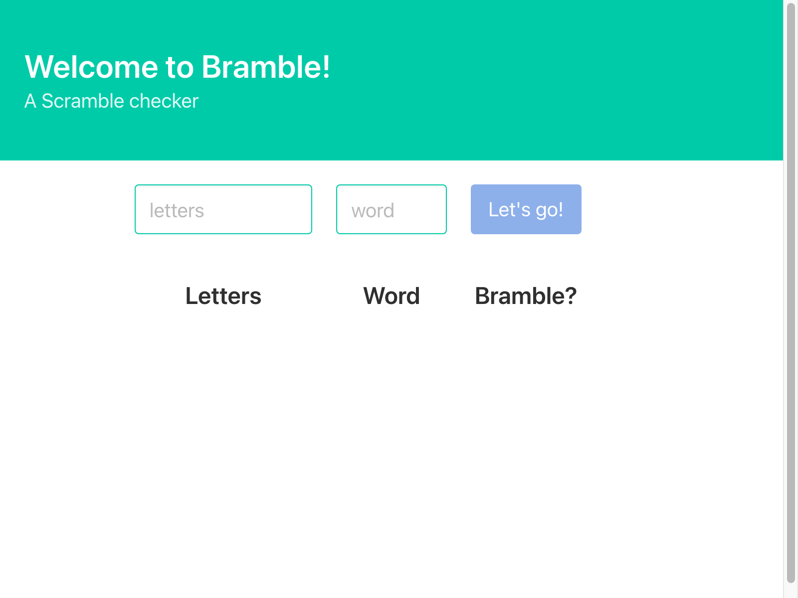

# Bramble

A Scramble checker



## Functionality

* A library that checks if a `word` can be formed by the given `letters`.
    ```clojure
    ;; (string, string) -> boolean
    (scramble? letters word) ;; => false
    ```

* A cli application that exposes the above function to the commandline.

* An HTTP server that listens on a given port for a POST on route `/api` and expecting a body in the shape:
    ```clojure
    {:letters "poolofletters" :word "targetword"}
    ```
    The successful answer has status `200` and the form:
    ```clojure
    {:letters "poolofletters" :word "targetword" :scramble? false}
    ```
    A malformed request has a status of `400` and a body with a [malli](https://github.com/metosin/malli) explanation attatched.

    The api handles all formats [muuntaja](https://github.com/metosin/muuntaja) handles out of the box.

* A cljs SPA made with [scittle](https://github.com/borkdude/scittle), that is hosted from the same server as the api, and uses it to provide the same functionality to be used by the fronted.

## Usage

Run tests (assuming you have any of the browser drivers supported by [etaoin](https://github.com/igrishaev/etaoin)):

    $ clojure -M:dev:test

To skip the browser tests add `--skip yvern.scramble.e2e` to the end of the command.

Run the cli app:

    $ clojure -M:scramble world word
    Yes we got scramble!


Build runnable uberjar for the cli app (`scramble.jar`):

    $ clojure -X:pkg:cli:no-api
    $ java -jar scramble.jar world word
    Yes we got scramble!


Run the server, both the api and hosting the webapp:

    $ clojure -M:dev-client 8080

when not compiling, the cljs app will be loaded on each request to be served, so you get easy reloading.


Build runnable uberjar for the api and web app (`scramble-api.jar`):

    $ clojure -X:pkg:api

here the cljs app is loaded on compile-time and served from memory.


Appart from the clojure cli, there is also a `Dockerfile` to not only build all of the above, but also provide an anvironment to run all tests and build a single static binary native cli app via graalvm:

    $ docker build -t TAG --target TARGET .

where `TAG` would be the name you desire to call it, and the `TARGET` could be any of:

* `deps`: download dependencies for testing and for the project itself
* `tested`: run all tests, used as a 'requirement' for further building
* `cli` and `api`: build specified app and put it in an openjdk jre image, ready to run
* `cli-bin`, or just omitting target: use graalvm to compile the cli app jar into a native standalone executable, and put it into an empty `scratch` image, for small size and fast startup

## Choices

* `scittle` instead of a full blown, aot compiled clojurescript project:

    given the simplicity and lack of performance/size criticality of the web app, the interactive and straightforward nature of scittle made development much easier than a more complex setup.

## License

Copyright © 2021 Yuri Vendruscolo da Silveira

Distributed under the Eclipse Public License version 1.0.
